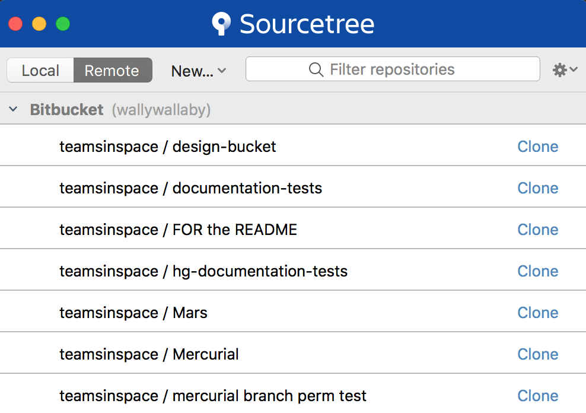

# GitHub Tutorial

- **Who is this for**: Anyone interested in starting using GitHub for Continuous testing/integration.
- **What you'll learn**: We'll introduce repositories, issues, branches, commits, pull requests, tests, and workflows.
- **What you'll build**: We'll write some short code (a Hello World function) and a automated test for it.
- **Prerequisites**: None. This course is a great introduction for your first day on GitHub.
- **How long**: This course is four steps long and takes less than one hour to complete.

_Welcome to "Introduction to GitHub"! :wave:_

**What is GitHub?**: GitHub is a collaboration platform that uses [Git](https://docs.github.com/get-started/quickstart/github-glossary#git) for versioning. GitHub is a popular place to share and contribute to [open-source](https://docs.github.com/get-started/quickstart/github-glossary#open-source) software.
<br>:tv: [Video: What is GitHub?](https://www.youtube.com/watch?v=w3jLJU7DT5E)

**What is Sourcetree**: [Sourcetree](https://www.sourcetreeapp.com/) is a free Git client for Windows and Mac. It is useful both for beginers or people with little command line experience, AND for experts who want to do more advanced work like reviewing changesets, stashing, cherry-pick ingbetween branches and more.

**What is a repository?**: A [repository](https://docs.github.com/get-started/quickstart/github-glossary#repository) is a project containing files and folders. A repository tracks versions of files and folders.
<br>:tv: [Video: Exploring a repository](https://www.youtube.com/watch?v=R8OAwrcMlRw)

**What is a branch?**: A [branch](https://docs.github.com/en/get-started/quickstart/github-glossary#branch) is a parallel version of your repository. By default, your repository has one branch named `main` and it is considered to be the definitive branch. You can create additional branches off of `main` in your repository. You can use branches to have different versions of a project at one time.

On additional branches, you can make edits without impacting the `main` version. Branches allow you to separate your work from the `main` branch. In other words, everyone's work is safe while you contribute.
<br>:tv: [Video: Branches](https://www.youtube.com/watch?v=xgQmu81G1yY)

**What is Trunk-Based Development?** [Trunk Based Development]() is a branching model, where developers collaborate on code in a single branch called ‘trunk’ (or on their short lived feature branches). You should resist any pressure to create other long-lived development branches by employing documented techniques. You avoid merge hell, do not break the build, and live happily ever after. 

## How to use this tutorial

1. Above these instructions, right-click **Use this template** and open the link in a new tab.
   
2. In the new tab, follow the prompts to create a new repository.
   - For owner, choose your personal account or an organization to host the repository.
   - We recommend creating a public repository—private repositories will [use Actions minutes](https://docs.github.com/en/billing/managing-billing-for-github-actions/about-billing-for-github-actions).
   
3. After your new repository is created, wait about 20 seconds, then refresh the page. Follow the step-by-step instructions in the new repository's README.

<details id=1>
<summary><h2>Step 1: Clone your Repository Using SourceTree</h2></summary>
1. From SourceTree, click Remote. All of your remote projects display.

2. Click Clone next to the repository you wish to clone locally.
3. From the Clone a repository window, click Clone. Click Local to see a list of your cloned repositories. 
</details>

<details id=2>
<summary><h2>Step 2: Create branches for Trunk Based Development</h2></summary>

### :keyboard: Activity: Your first branch with Sourcetree

1. From Sourcetree, click the Branch button.
2. From the New Branch field, enter a name for your branch- we'll call this one "develop".
3. Click Create Branch.

_You created a branch! :tada:_

The **develop** branch...

Now, do the same for a feature branch, we'll call "hello".

Now you are all set to start developing!

</details>

<details id=3>
<summary><h2>Step 3: Commit a file</h2></summary>

Now that you are on your feature branch, you can edit your project without changing the `main` branch. It’s time to create a file and make your first commit!

**What is a commit?**: A [commit](https://docs.github.com/pull-requests/committing-changes-to-your-project/creating-and-editing-commits/about-commits) is a set of changes to the files and folders in your project. A commit exists in a branch.

### :keyboard: Activity: Your first commit

The following steps will guide you through the process of committing a change on GitHub using Sourcetree. Committing a change requires first adding a new file to your new branch. 

1. In your favorite IDE, make sure you're on your new branch `hello`.
2. Create a new file called `hello.py`.
3. In your IDE, copy the following content to your file:
   ```
   def hello(name: str):
        print('Hello, ' + name + '!')
   ```
4. Open the History view in SourceTree and notice that your repository now has uncommitted changes.
5. Click the check mark next to `Unstaged Files` to stage all of your changes.
6. Click the Commit button at the top to commit the file.
7. In the message box, enter a commit message.
8. Click the Commit button under the box. From Sourcetree's History, you'll see that the file has been updated on your new branch.
9. Click the Push button to push your new branch to the repository.
10. Under the Push? column from the dialog box that appears, select your new branch to indicate that you are pushing that branch to origin and click OK.
</details>

<details id=4>
<summary><h2>Step 4: Create a test</h2></summary>

</details>

<details id=5>
<summary><h2>Step 5: Open a pull request</h2></summary>

_Nice work making those commits :sparkles:_

Now that you’ve created a commit, it’s time to share your proposed change through a pull request!

**What is a pull request?**: Collaboration happens on a pull request. The pull request shows the changes in your branch to other people. This pull request is going to keep the changes you just made on your branch and propose applying them to the `main` branch.
<br>:tv: [Video: Introduction to pull requests](https://youtu.be/kJr-PIfLDl4)

### :keyboard: Activity: Create a pull request

You may have noticed after your commit that a message displayed indicating your recent push to your branch and providing a button that says **Compare & pull request**.


 If you want, feel free to click **Compare & pull request**, and then skip to step 6 below. If you don't click the button, the instructions below walk you through manually setting up the pull request.

1. Click on the **Pull requests** tab in your repository.
2. Click **New pull request**.
3. In the **base:** dropdown, make sure **main** is selected.
4. Select the **compare:** dropdown, and click `my-first-branch`. <br>
   
5. Click **Create pull request**.
6. Enter a title for your pull request: `Add my first file`.
7. The next field helps you provide a description of the changes you made. Feel free to add a description of what you’ve accomplished so far. As a reminder, you have: created a branch, created a file and made a commit! <br>
   
8. Click **Create pull request**.
9. Move on to Step 4! <br>
   **Note**: Like before, you can wait about 20 seconds, then refresh this page (the one you're following instructions from) and [GitHub Actions](https://docs.github.com/en/actions) will automatically close this step and open the next one. As a perk, you may see evidence of GitHub Actions running on the tab with the pull request opened! The image below shows a line you might see on your pull request after the Action finishes running.<br>
   

</details>

<details id=6>
<summary><h2>Step 6: Merge your pull request</h2></summary>

_Nicely done friend! :sunglasses:_

You successfully created a pull request. You can now merge your pull request.

**What is a _merge_**: A [merge](https://docs.github.com/en/get-started/quickstart/github-glossary#merge) adds the changes in your pull request and branch into the `main` branch.
<br>:tv: [Video: Understanding the GitHub flow](https://www.youtube.com/watch?v=PBI2Rz-ZOxU)

As noted in the previous step, you may have seen evidence of an action running which automatically progresses your instructions to the next step. You'll have to wait for it to finish before you can merge your pull request. It will be ready when the merge pull request button is green.


### :keyboard: Activity: Merge the pull request

1. Click **Merge pull request**.
1. Click **Confirm merge**.
1. Once your branch has been merged, you don't need it anymore. To delete this branch, click **Delete branch**.<br>
   
2. Check out the **Finish** step to see what you can learn next!<br>
   **Note**: Like before, you can wait about 20 seconds, then refresh this page (the one you're following instructions from) and [GitHub Actions](https://docs.github.com/en/actions) will automatically close this step and open the next one.

</details>

<details id=7>
<summary><h2>Step 7: Set up an automated workflow</h2></summary>

</details>
